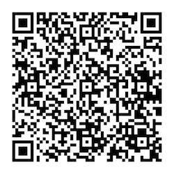
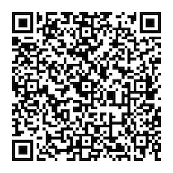
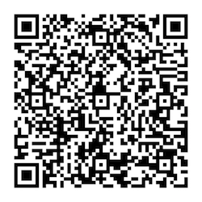
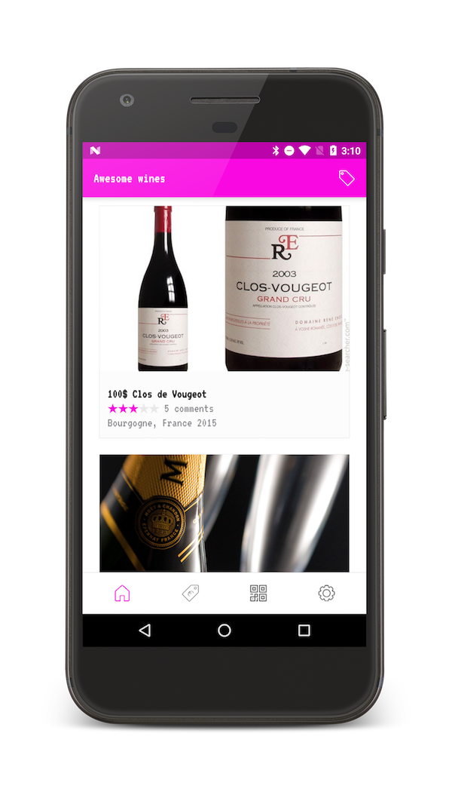
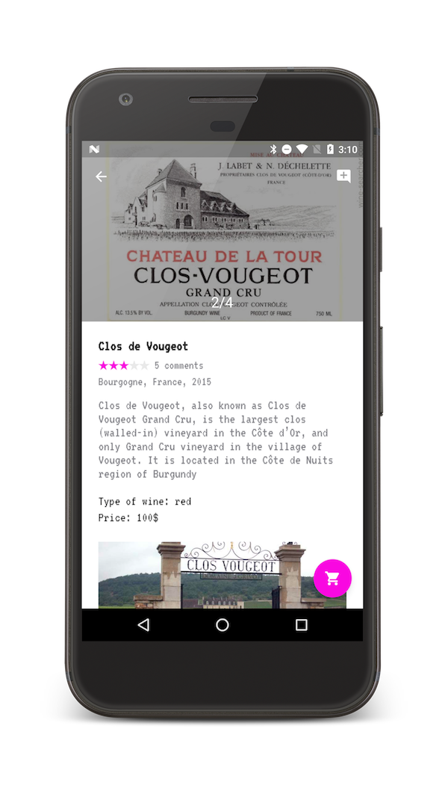
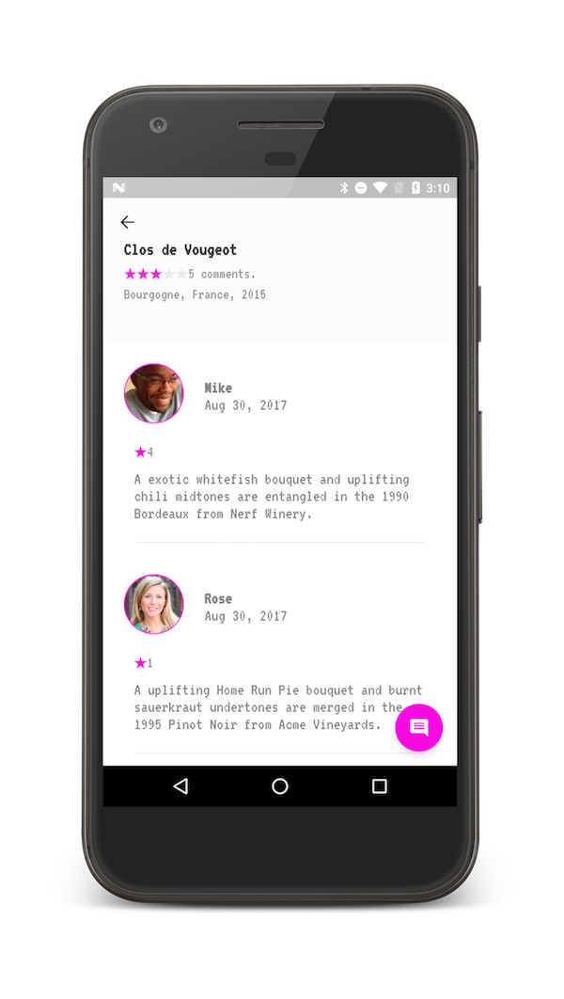
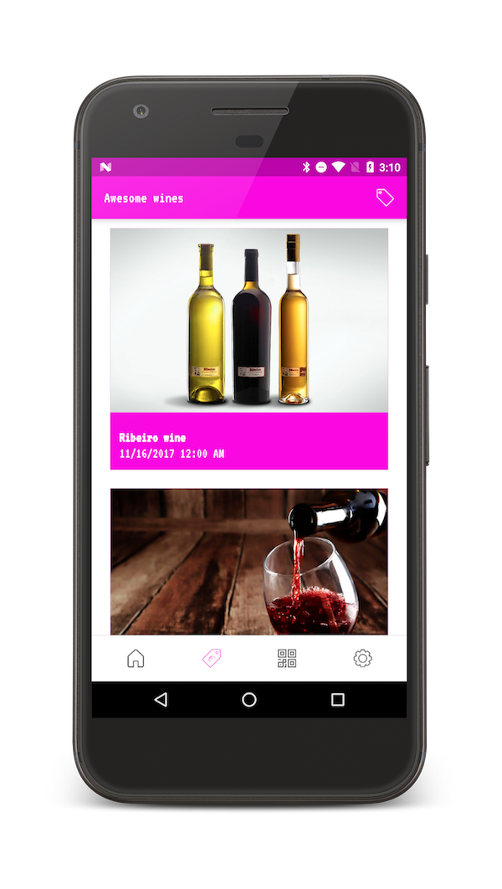
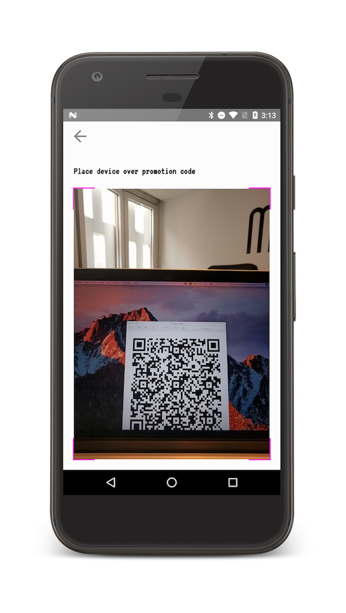
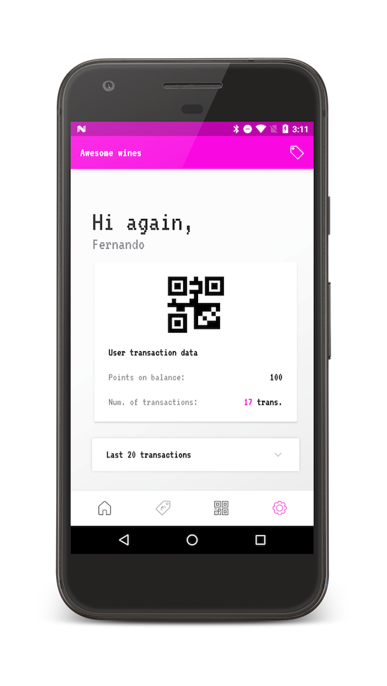

# Awesome wines

List of wines based on dynamic image slideshows with a comment related module to rate every wine. Using the loyalty module of HALO we can have promotions with our clients or share by push the promotion code to another user. You can change the screen settings with a silent push notification ( colors, sizes, fonts, menu options, etc). The app can scan a BIDI code to redeem a stamp or a price discount (loyalty points), show details of the promotion and current number of stamp collected, redeem a gift and show updated results the operations.

The app uses the following libraries of HALO SDK:

- **HALO Loyalty API**: to generate and redeem promotion codes.
- **HALO Content API**: provides all the content of the app. See also [Content API](../content/android_content_overview.html).
- **HALO Auth API**: to login or create users. See also [Auth API](../auth/android_auth_overview.html).
- **HALO Notification API**: send push notifications. See also [Notification API](../notifications/android_notifications_overview).

### BIDI Codes

The valid types for redeemables are stamps, items and prizes. Stamps are promotional codes that a user can redeem to collect badges until a number when the user can request a gift. Prizes are objects you can exchange for points, so they must have a non positive value in pointsOperated field. In case of items, the amount must be non negative.

| Stamp | |
|-----------------|---------|
|  | This is an example of stamp. You need to collect 5 stamps until you can request the gift with this example.|

| Pize 1000 | |
|-----------------|---------|
|  | This is an example of prize. If you have loyalty points on your balance you can redeem the code to obtain the offer. Prize always is a non positive value. In this case it will use 1500 points. |

| Item 200 | |
|-----------------|---------|
|  | This is an example of item. You can redeem the code to obtain loyalty points on your balance. Item always is a positive value. In this case you get 200 points. |

### Screenshots

| Wines catalog | Wines detail |
|-----------------|---------|
|  | |

| Wines comment |  Wines offers |
|------------------|---------------------|
| | |

| Scan codes screen | User profile |
|------------------|---------------------|
| | |