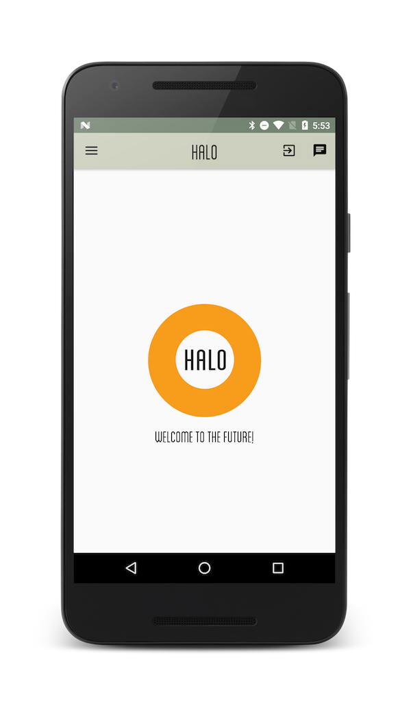
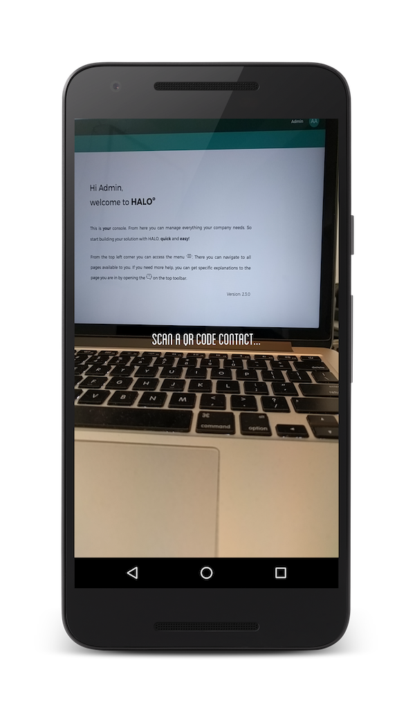
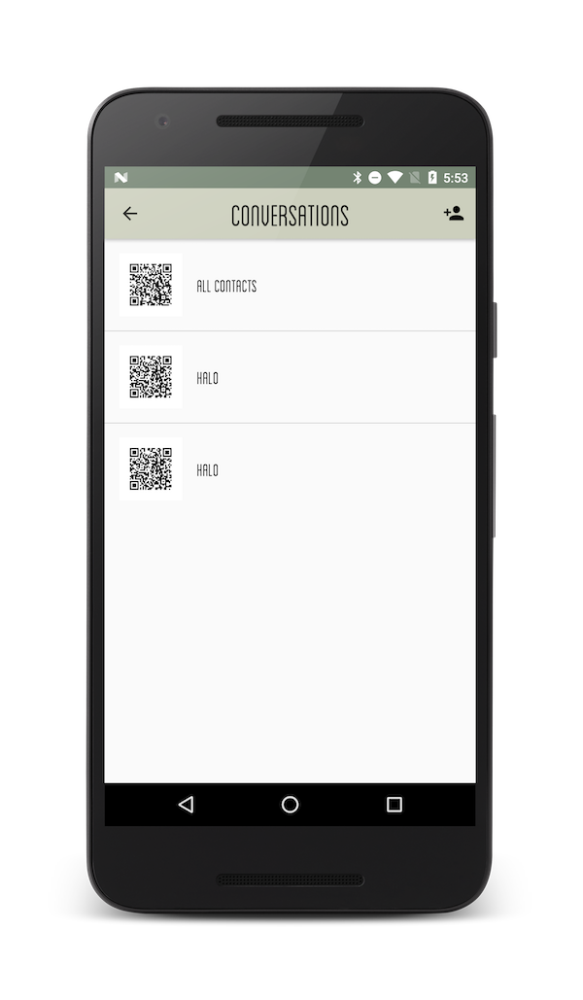
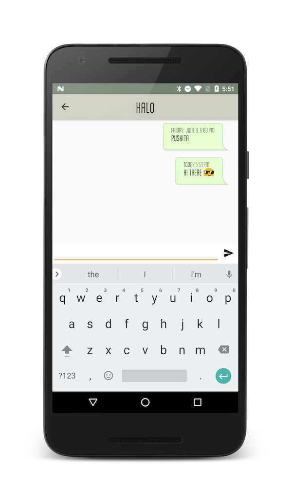

# One to one chat

Using the content module of HALO we store all the data to have the possibility to maintain long lasting one to one conversations that can "survive" even when the app has been closed. The app generate a BIDI code to share with other users and after pairing you can chat with push notifications.

The app uses the following libraries of HALO SDK:

- **HALO Notification API**: to send push notifications. See also [Auth API](../auth/android_auth_overview.html).
- **HALO Content API**: provides all the content of the app. See also [Content API](../content/android_content_overview.html).
- **HALO Auth API**: to login or create users. See also [Notifications API](../notifications/android_notifications_overview.html).

You can download the source code in the following link: [Chat POC](https://github.com/mobgen/halo-android/tree/develop/sdk-samples/halo-demo)

<!---You can try this app in the following link: [Chat POC](https://google.com) -->

### Screenshots

| Home screen | Scan BIDI user code |
|-----------------|---------|
|  | |

| Contact list | Chat screen |
|------------------|---------------------|
| | |