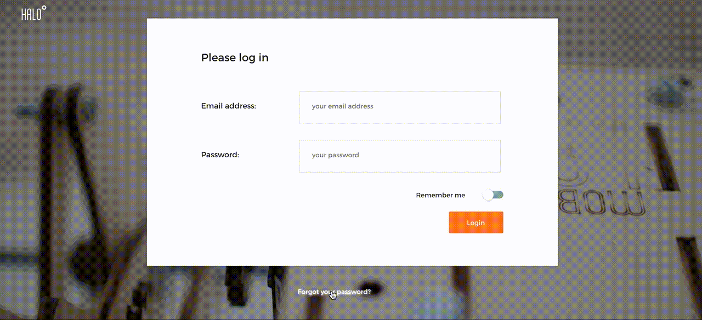

You may want to reset your password because you forgot it or just for security reasons. In this case you can access
a form in the login screen to reset it securely:

1. Click on '*Forgot your password?*'.
2. In the form that appears enter the email you used to register the account on HALO.
3. If the email entered was valid, you will receive an email with a link you can click on to reset your password.
4. A new form will appear to allow you to enter the new password.

> This form will not notify you if this was the correct account to avoid attackers to retrieve the emails we have stored in halo.

At this point your new password should be available and you can login again using it.

