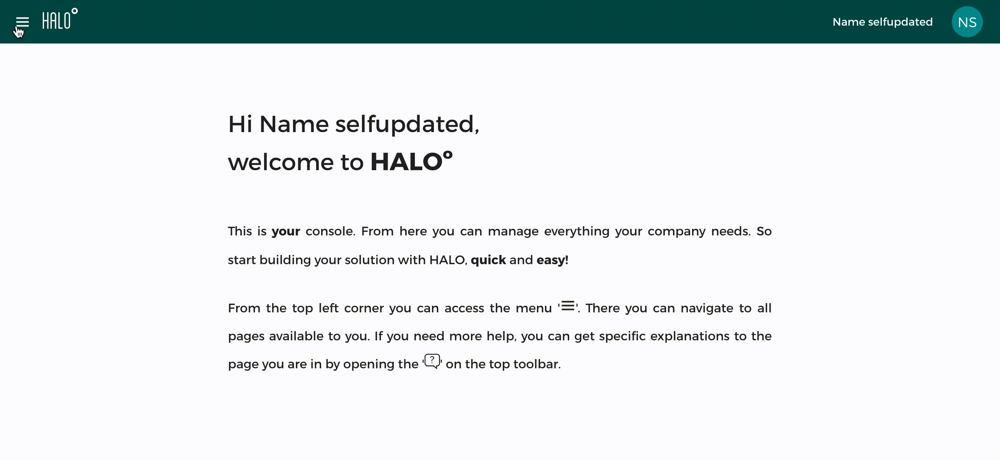

## Configure notifications for the apps

Before start sending notifications you must configure the notifications in the application by creating a
firebase project. Refer to the [firebase documentation](https://firebase.google.com/docs/cloud-messaging/) to
setup firebase cloud messaging for your Android and iOS apps.

Once it is configured you can come again as an admin and modify your app instance to support notifications:

- In the top left menu select '*Apps*'.
- In the list select your app if you already have one or create a new one.
- Where it states FCM key you have to enter the firebase server key. Use the legacy one since we still do 
not support the new format.

## Operations with notifications

### Send a notification

- In the top left menu select '*Notifications*'.
- Between the two tabs, select the '*Notification messages*'.
- In the top action bar press on the button ' *New push message*'.
- In the form you must select an already configured template. To learn more visit [this tutorial](cms_notifications_template).
- Add a name for this push you are about to send. It will appear in the list to  visit it later.
- Select the app that will receive the application. Remember it must have FCM configured on it.
- Optionally you can configure a schedule date and time for the push.
- Optionally you can also attach some tags to segment the public.
- Finally fill in all the elements of the template (message, sound, etc.)
- Send the push by clicking in the top action bar on '*Send*' or save it as concept.

### Check notification stats

Once a notification has been scheduled to be sent, we generate some stats about the results the service
provide. To check this stats:

- In the top left menu select '*Notifications*'.
- Between the two tabs, select the '*Notification messages*'.
- Make sure the dropdown filter is selecting 'Sent'.
- Search for the sent notification.
- Click on it and watch the stats on the top of the form.

### Remove notifications

You can remove notifications that are saved as concept or sent:

- In the top left menu select '*Notifications*'.
- Between the two tabs, select the '*Notification messages*'.
- In the dropdown select the type of notification you want to delete (sent or saved).
- Finally find the entry to be deleted and in the right side click on the  trash.

> **Important:** In the case of sent notifications removing it will not mean that those devices who received the previous notification will dismiss it.